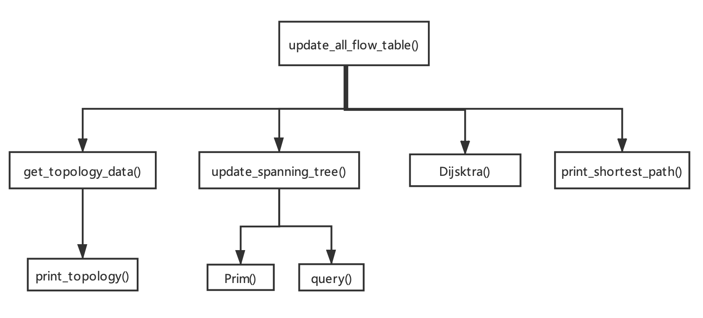
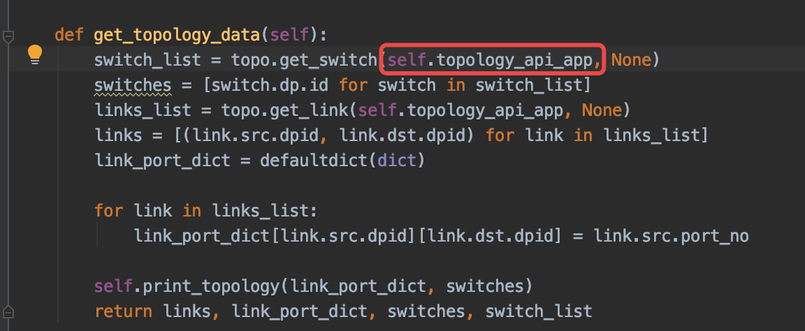
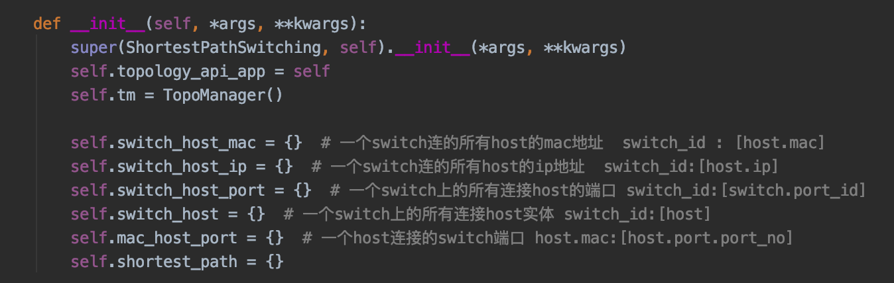

# SDNs 
CS305 final project

11712738 武羿
11712121 胡玉斌
11612003 彭可
## 1. Command 
$ ryu-manager --observe-links shortest_paths.py

$ sudo python run_mininet.py [network topology]
## 2. Impelented Function
1. **Shortest Path**
2. **Flood without loops  (Bonus)**

We implement main functions and methods in shortest_paths.py

### 3. Code Structure

The methods in the picture below are all implemtented in shortest_paths.py

## 4. Design Detail

### 4.1 Flow Table Updating
Evey time when the topology of the network is changed, we reset and update the flow table in every switch. We set both the **shortest path** and path for **flood without loops** in the flow table .

### 4.2 Shortest Path
We use **Dijsktra** algorithm to calculate the shortest paths.

### 4.2 Flood without loops
We use **Prim** algorithm to generate the spanning tree of the current network. Then given a Root switch,  we run BFS on the spanning tree to get the forwarding paths for ARP Packects.

### 4.3 Controller handle Packet in 
We implement the function of Controller to handle ARP packet in the packet_in_handler() method. When the Controller know the mac address , it returns an ARP reply. When the Controller does not know the mac address , it flood the ARP request. 

**Notice** that no ARP packet is sent to the Controller after we implement Flooding without loops. Because we have specifiyed the paths for an ARP packet to forward among hosts and switches.

### 4.4  Network topology
Evey time when the topology of the network is changed, we get the topology data of the current network by using **app_manager.RyuApp** .

We also store the connection info of switches and hosts in Python dictionary Structure, which is convenient to query the data in later usage.

