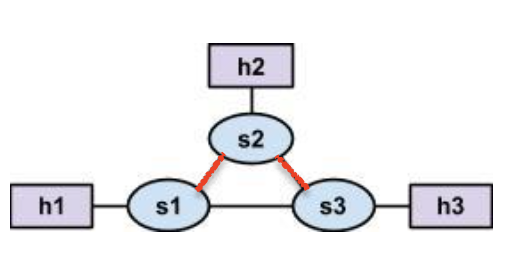

# SDNs 
CS305 final project

11712738 武羿
11712121 胡玉斌
11612003 彭可
# Background 
## SDN

## RYU

## Mininet

# Implementation
## Function 1 Controller handle ARP packet

## Function 2 Update Flow Table
### code structure

### Method Details
update_all_flow_table()
get_topology_data()
update_spanning_tree()
Prim()
query()
**Dijsktra()**: Given a source node S, caculate the shortest path form S to all the other nodes in the current network topology graph.
**print_shortest_path()** : Print shortest paths for every switch.

## Bonus

# Test
## For mininet triangle

1. Test command 'pingall'

2. ping an unexist ip address 10.0.0.100

Use TCPDUMP to capture arp  packet
No flood ,only 3 ARP request packtes captured.

3. Print Shortest Path

4. Print topology graph

5. Print Spanning Tree
Notice that for each edge, we print bidirectionally.

6. Change topology

Shortest Path after change

Spanning tree and topology after change

Flow table after change

# Contribution
name | Percentage |   Task 
-|-|-
武羿 | 33.3%|  |
胡玉斌 | 33.3% |  |
彭可 | 33.3% | |

