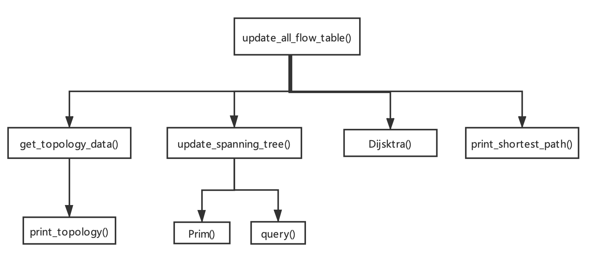
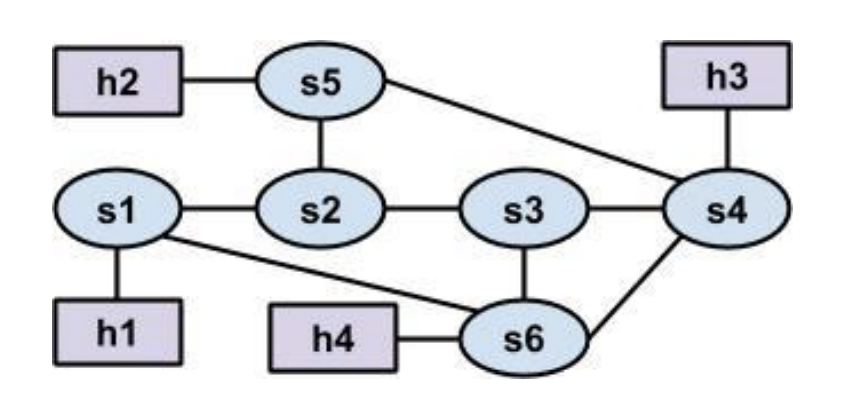

# SDNs Report
CS305 final project

11712738 武羿
11712121 胡玉斌
11612003 彭可
## 1. Background 
### The understanding for SDN

As we all know, in SDN, or software-defined network, a distinct (typically remote) controller interacts with local control agents in switches/routers to compute forwarding tables. Unlike difficult traditional routing who implements a distributed algorithm in every switch/router, a logically centralized control plane is easier to manage the whole network, avoiding router misconfigurations. In our understanding, if we could “extract” the control plane out of the routers, then it would be easier to add, modify and delete the routing logic, and enable the network to adapt to more complex usage scenarios. If there are some changes need to be made, we could just modify the remote controller since no algorithm is implemented in routers/switches. It’s just like a kind of “design pattern” intending to reduce the coupling degree of the network, and the best solution of which is to separate the "model layer" and "controller layer".

### The understanding for Ryu

As far as we are concerned, Ryu controller is an open-source SDN / OpenFlow controller developed by NTT company in Japan. The controller is named "flow" in Japan, so it's called Ryu. Ryu controller is completely written in Python language, similar to POX. Ryu controller now supports OpenFlow version 1.0, 1.2, 1.3 and 1.4, and supports the combination of OpenStack and cloud computing. Ryu adopts the Apache license open-source protocol standard. In this project, we use Ryu with OpenFlow 1.0 to control the whole virtual network.

### The understanding for mininet

In our understanding, mininet is a network simulator connected by some virtual terminal nodes, switches, and routers. It uses lightweight virtualization technology to make the system comparable to the real network.

Mininet can easily create a network supporting SDN: host works as a real computer, can log in Using SSH, start the application program, the program can send data packets to the Ethernet port, and the data packets will be received and processed by the switch and router. With this network, we can flexibly add new functions to the network and conduct relevant tests, and then easily deploy to the real hardware environment. In this project, we used some topologies provided by mininet to simulate the real network environment.

## 2. Implementation
###2.1: Function 1 Controller handle ARP packet
Code Logic and Struture :

Code detail :

**Notice** that after we implement the spaninng tree to forward arp packets in swtiches, there is no arp packets delivered to the controller any more.

###2.2 Function2: Flooding without loops and  Shortest path

#### code structure

#### Method Details

**update_all_flow_table()**: This method is called whenever the network topology changes. Calling other methods to update the flow table in switches. Especially, the update for shortest path in flow table is implemented in this method.

**get_topology_data()**: get the topology infomation of the current network, including how switches are connected and through which ports.

#### Shortest Path:

**Dijsktra()**: Given a source node S, caculate the shortest path form S to all the other nodes in the current network topology graph.

**print_shortest_path()** : Print shortest paths for every switch.

#### Flooding without loops:
**update_spanning_tree()** :To implement flooding without loops. Update the switches flow table to specify the direction in which Arp packects are forwarded, based on a spanning tree structure of the current network topology.

**Prim()**: generate a minimum spanning tree for the current network topology.

**query()**: Given a root node, run BFS on the spanning tree, return a dictionary that contains the children sets of every node .

##2.3 Obtain Network topology
Evey time when the topology of the network is changed, we get the topology data of the current network by used function of app_manager.RyuApp.

## 3. Test
### 3.1 Mininet triangle

1. **Test command 'pingall'**

2. **ping an unexist ip address 10.0.0.100**

Use TCPDUMP to capture arp  packet
No flood ,only 3 ARP request packtes captured.

3. **Print Shortest Path**

4. **Print topology graph**

5. **Print Spanning Tree**
Notice that for each edge, we print bidirectionally.

6. **Change topology**

**Shortest Path after change**

**Spanning tree and topology after change**

**Flow table after change**

### 3.2 Mininet someloops

1. Print Shortest path from s1 to other switches.

2. **Change topology**

3. **Print changed Shortest path from s1 to other switches.**

## 4. Contribution
Id| name | Percentage |   Task 
-|-|-|-
11712738 |武羿 | 33.3%| Implement shortest path and flooding without loops, Controller ARP packet handle |
11712121| 胡玉斌 | 33.3% | Configure the environment，implement flooding without loops|
11612003| 彭可 | 33.3% | Implement shortest path and alogrithms :Dijskta and Prim |

## 5. Conclusion
Through this project, we have a deeper understanding of the SDN. We learned how to code with RYU and how to use Mininet. It is very conveninet to control the whole network using just one controller. We also learned how to implement the shortest path and flooding without loops in practice.

The problem we met during the project: it is very important to "sudo mn -c ", that is to clean the previous mininet network every time you want to start a new one. Otherwise, the function of your code may not work well unexpectedly, even your codes are totally right.

